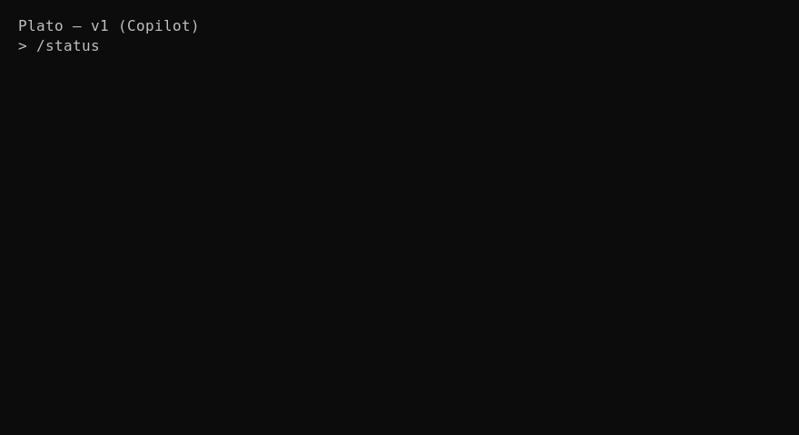

# Plato

[](https://github.com/anubissbe/plato/actions/workflows/ci.yml)
[](CHANGELOG.md)
[](https://github.com/anubissbe/plato/issues)
[](https://github.com/anubissbe/plato/commits/main)

Status: v1 (Claude Code parity, Copilot-backed)

Plato is a Claude Code–compatible terminal AI coding assistant wired to GitHub Copilot. It mirrors Claude Code’s CLI/TUI behavior: the assistant writes files immediately ("Write(filename)") with concise confirmations, while still supporting audit tools (diffs, revert) under the hood.

- Auth: GitHub Copilot device flow (keytar-backed if available)
- Models: Copilot’s OpenAI-compatible chat (configurable model)
- Tool bridge: strict JSON tool_call blocks → MCP shim → streamed follow-up
- Patch engine: unified diffs, dry-run, apply/revert (Git required)
- Minimal parity commands: `/apply`, `/revert`, `/run`, `/permissions`, `/proxy`, `/todos`, `/statusline`, `/resume`

## Quick Start

```bash
npm ci
npm run dev  # starts the TUI
```

In the TUI:
- `/doctor` — verify binaries and Copilot base
- `/login` — device code login to GitHub; then `/status`
- `/proxy start --port 11434` — start local OpenAI-compatible proxy; `/proxy stop`
- `/todos scan` and `/todos list` — gather TODOs
- `/statusline set "plato | {provider} | {model} | {tokens} {branch}"`
- `/resume` — restore last session (auto-saved to .plato/session.json)

## Tool-Call Bridge (MCP)
Plato expects the assistant to emit a single fenced JSON code block to request tool runs:

```json
{"tool_call": {"server": "<server-id>", "name": "<tool-name>", "input": {}}}
```

- No prose inside the block; valid JSON only
- Permissions enforced; results appended; assistant continues streaming

See Verification Guide for a full walkthrough.

## Demo
Add your short GIF at `docs/assets/plato-demo.gif` and it will render here:



## Verification Guide
See `docs/verification.md` to test Copilot login and an end-to-end tool_call using the included mock MCP server.

## Claude Parity Setup (optional)
For exact Claude-style write behavior:
- `/permissions default fs_patch allow`
- `/apply-mode auto`
Now requests like “create hello.py with hello world” will immediately write and show:
```
● Write(hello.py)
  ⎿  Wrote 1 lines to hello.py
     print("Hello, World!")

● Done! Created hello.py with a Hello World program.
```

## Terminal Compatibility

### WSL/Docker Environments
In environments where raw mode isn't supported (WSL, Docker, some CI systems), Plato automatically falls back to compatible input handling. You may see a raw mode warning, but functionality remains intact.

### Copy/Paste Support
Mouse copy/paste is enabled by default (like Claude Code):

1. **Default Behavior**: Mouse mode is automatically enabled
   - Keyboard typing works normally (typing should be smooth and responsive)
   - Terminal copy/paste is supported through mouse events and escape sequences  
   - Shows 🖱️ MOUSE indicator in status line
   - Use `/mouse off` only if you experience any issues

2. **Temporary paste mode**: `/paste [seconds]` (if copy/paste still doesn't work)
   - Completely disables input for 5 seconds (or custom duration)
   - Shows 📋 PASTE mode indicator
   - Allows unrestricted terminal copy/paste
   - Auto-restores after timeout

3. **Toggle if needed**: `/mouse [on|off|toggle]`
   - Most users won't need to change this
   - Only disable if you need advanced keyboard features

4. **Check Terminal Settings**: Some terminals require specific settings for proper mouse support

5. **Alternative**: Use CLI commands directly:
   ```bash
   npx tsx src/cli.ts models        # List models
   npx tsx src/cli.ts config get    # View config  
   npx tsx src/cli.ts status        # Check status
   ```

## Notes
- Patch application requires a Git repository. Run `git init` if needed.
- Credentials are stored in the OS keychain when possible; fallback to `~/.config/plato/credentials.json`.

## Changelog
See [CHANGELOG.md](./CHANGELOG.md).
