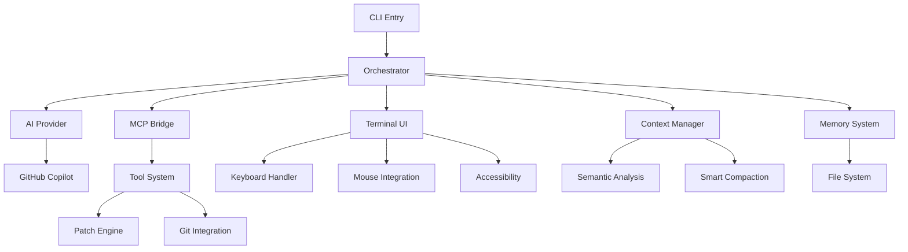

# PlatoV3 Project Index

## Quick Navigation

- [Architecture Overview](#architecture-overview)
- [Core Systems](#core-systems)
- [Command Reference](#command-reference)
- [API Documentation](#api-documentation)
- [File Structure](#file-structure)
- [Configuration](#configuration)
- [Development Guide](#development-guide)

## Architecture Overview

```
┌────────────────────────────────────────────────────────┐
│                   User Interface Layer                  │
│                  React + Ink Terminal UI                │
├────────────────────────────────────────────────────────┤
│                Runtime Orchestration Layer              │
│          Conversation Management & Tool Bridge          │
├────────────────────────────────────────────────────────┤
│    Provider Layer        │      Integration Layer       │
│   GitHub Copilot AI       │     MCP Server Bridge       │
├────────────────────────────────────────────────────────┤
│                    Core Services Layer                  │
│     Memory | Context | Patch Engine | Commands          │
└────────────────────────────────────────────────────────┘
```

## Core Systems

### 1. Runtime Orchestrator (`src/runtime/`)
- **Purpose**: Central conversation and tool management
- **Key Files**: 
  - `orchestrator.ts` - Main orchestrator class
  - `headless.ts` - Headless mode support
  - `status-events.ts` - Event system
- **Capabilities**: Streaming responses, tool execution, memory management

### 2. Provider System (`src/providers/`)
- **Purpose**: AI model integration
- **Key Files**:
  - `copilot.ts` - GitHub Copilot integration
  - `chat_fallback.ts` - Fallback provider
  - `chat.ts` - Base interface
- **Features**: OAuth authentication, streaming, model switching

### 3. Tool-Call Bridge (`src/integrations/`)
- **Purpose**: MCP server integration
- **Key Files**:
  - `mcp.ts` - MCP protocol implementation
  - `proxy.ts` - OpenAI-compatible proxy
- **Features**: Tool discovery, permission enforcement, retry logic

### 4. Patch Engine (`src/tools/`)
- **Purpose**: Git-based file modifications
- **Key Files**:
  - `patch.ts` - Diff processing
  - `git.ts` - Git operations
  - `permissions.ts` - Security
- **Features**: Unified diffs, rollback, journal tracking

### 5. Memory System (`src/memory/`)
- **Purpose**: Persistent conversation storage
- **Key Files**:
  - `manager.ts` - Memory lifecycle
  - `types.ts` - Type definitions
- **Features**: Auto-save, compaction, session recovery

### 6. Context Management (`src/context/`)
- **Purpose**: Intelligent context handling
- **Key Files**:
  - `semantic-analyzer.ts` - Semantic analysis
  - `intelligent-compaction.ts` - Smart compression
  - `context-scoring.ts` - Relevance scoring
- **Features**: Semantic indexing, thread preservation, quality metrics

## Command Reference

### System Commands
| Command | Description |
|---------|-------------|
| `/help` | Show command help |
| `/version` | Display version |
| `/doctor` | Diagnose setup |
| `/status` | Show system status |
| `/exit`, `/quit` | Exit application |

### Authentication
| Command | Description |
|---------|-------------|
| `/login` | GitHub Copilot auth |
| `/logout` | Clear credentials |
| `/auth` | Check auth status |

### Model Management
| Command | Description |
|---------|-------------|
| `/model` | List models |
| `/model <name>` | Switch model |
| `/models` | Available models |

### Session Management
| Command | Description |
|---------|-------------|
| `/save` | Save session |
| `/resume` | Restore session |
| `/reset` | Clear session |
| `/memory` | Memory management |
| `/compact` | Compact history |

### MCP Integration
| Command | Description |
|---------|-------------|
| `/mcp attach <name> <url>` | Attach server |
| `/mcp detach <name>` | Remove server |
| `/mcp list` | List servers |
| `/mcp tools` | Available tools |

### File Operations
| Command | Description |
|---------|-------------|
| `/apply` | Apply patches |
| `/revert` | Revert patches |
| `/apply-mode <mode>` | Set apply mode |
| `/patches` | Show patches |

### Development
| Command | Description |
|---------|-------------|
| `/todos scan` | Find TODOs |
| `/todos list` | List TODOs |
| `/proxy start` | Start proxy |
| `/debug` | Debug mode |

### UI Controls
| Command | Description |
|---------|-------------|
| `/clear` | Clear screen |
| `/theme <name>` | Change theme |
| `/output-style <style>` | Output format |
| `/mouse [on\|off]` | Mouse mode |
| `/paste [seconds]` | Paste mode |

## API Documentation

### Orchestrator API

```typescript
interface Orchestrator {
  // Conversation
  respond(input: string): Promise<string>;
  respondStream(input: string, onDelta: (text: string) => void): Promise<void>;
  
  // Messages
  addMessage(message: Message): void;
  getMessages(): Message[];
  
  // Tools
  executeTool(call: ToolCall): Promise<ToolResult>;
  
  // Memory
  saveMemory(): Promise<void>;
  loadMemory(): Promise<void>;
  compactMemory(options?: CompactionOptions): Promise<void>;
  
  // Metrics
  getMetrics(): Metrics;
  updateTokenMetrics(input: number, output: number): void;
}
```

### Provider Interface

```typescript
interface ChatProvider {
  respond(input: string): Promise<string>;
  respondStream(input: string, onDelta: (text: string) => void): Promise<void>;
  isAuthenticated(): boolean;
  authenticate(): Promise<void>;
  getModels(): Promise<Model[]>;
  setModel(model: string): void;
}
```

### MCP Tool Interface

```typescript
interface MCPTool {
  name: string;
  description: string;
  parameters: Record<string, any>;
  execute(params: any): Promise<any>;
}
```

## File Structure

```
platoV3/
├── src/
│   ├── cli.ts                 # Entry point
│   ├── runtime/               # Orchestration (3 files)
│   ├── providers/             # AI providers (3 files)
│   ├── integrations/          # External integrations (2 files)
│   ├── tools/                 # Tool implementations (7 files)
│   ├── tui/                   # Terminal UI (50+ files)
│   ├── context/               # Context management (25+ files)
│   ├── memory/                # Memory system (2 files)
│   ├── commands/              # Custom commands (7 files)
│   ├── slash/                 # Slash commands (2 files)
│   ├── styles/                # Output styles (4 files)
│   ├── config/                # Configuration (2 files)
│   ├── platform/              # Platform-specific (4 files)
│   ├── persistence/           # State persistence (1 file)
│   ├── validation/            # Input validation (1 file)
│   ├── policies/              # Security policies (1 file)
│   └── __tests__/             # Test files (100+ files)
├── dist/                      # Compiled output
├── docs/                      # Documentation
├── scripts/                   # Utility scripts
├── .plato/                    # Runtime data
│   ├── session.json          # Current session
│   ├── mcp-servers.json      # MCP config
│   ├── patch-journal.json    # Patch history
│   ├── memory/               # Conversation memory
│   ├── commands/             # Custom commands
│   └── styles/               # Custom styles
└── coverage/                  # Test coverage

Total: 194 TypeScript files across 26 modules
```

## Configuration

### Environment Variables

```bash
PLATO_CONFIG_DIR=/custom/path     # Config directory
DEBUG=plato:*                     # Debug logging
PLATO_DEFAULT_MODEL=claude-3.5    # Default model
PLATO_MEMORY_INTERVAL=30          # Auto-save interval
```

### Configuration Files

| File | Purpose |
|------|---------|
| `~/.config/plato/credentials.json` | Auth credentials |
| `.plato/session.json` | Session state |
| `.plato/mcp-servers.json` | MCP servers |
| `.plato/patch-journal.json` | Patch history |
| `.plato/memory/` | Conversations |

### TypeScript Configuration

- **Production**: `tsconfig.json` (excludes tests)
- **Tests**: `tsconfig.tests.json` (includes tests)
- **Target**: ES2022
- **Module**: CommonJS
- **JSX**: react-jsx

## Development Guide

### Quick Start

```bash
# Install dependencies
npm ci

# Development mode
npm run dev

# Build project
npm run build

# Run tests
npm test

# Type checking
npm run typecheck

# Linting
npm run lint
```

### Key Scripts

| Script | Description |
|--------|-------------|
| `dev` | Development with tsx |
| `build` | Compile TypeScript |
| `test` | Run test suite |
| `typecheck` | Type checking |
| `lint` | ESLint checking |
| `fmt` | Prettier formatting |

### Testing

```bash
# All tests
npm test

# Unit tests
npx jest src/__tests__/unit

# Integration tests
npx jest src/__tests__/integration

# Single file
npx jest src/__tests__/keyboard.test.ts

# Coverage
npm test -- --coverage
```

### Performance Targets

- **Input Latency**: <50ms
- **Frame Rate**: 60fps
- **Memory Usage**: <500MB
- **Token Efficiency**: Smart compaction
- **Test Coverage**: 93%

### Accessibility Standards

- **WCAG 2.1 AA** compliance
- Screen reader support
- Keyboard navigation
- High contrast themes
- Focus management

## Module Dependencies



## Cross-References

### Data Flow
1. **User Input** → TUI → Keyboard Handler → Command Parser
2. **Command** → Orchestrator → Provider/Tool → Response
3. **Tool Call** → MCP Bridge → Permission Check → Execution
4. **Memory** → Auto-save → File System → Session Recovery

### Integration Points
- **GitHub Copilot**: OAuth device flow at `/login`
- **MCP Servers**: JSON-RPC at configured URLs
- **File System**: `.plato/` directory for all runtime data
- **Git**: Repository operations for patch application

### Quality Metrics
- **Build Status**: ✅ Passing (0 errors)
- **Test Coverage**: 93% (668 passing, 54 failing)
- **Performance**: <50ms latency, 60fps
- **Accessibility**: WCAG 2.1 AA compliant

---

*Last Updated: December 2024*  
*Version: 0.1.0*  
*Total Files: 194 TypeScript files*  
*Architecture: React + Ink + GitHub Copilot + MCP*